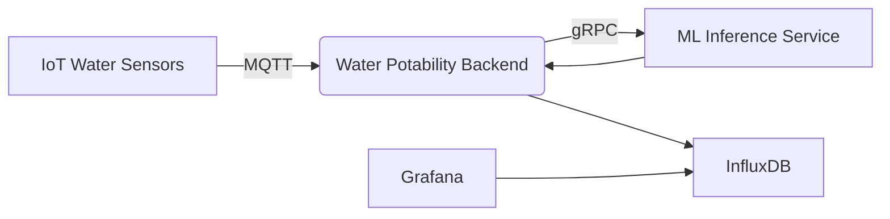

# Water Potability Backend

[](https://goreportcard.com/report/github.com/lab-icn/water-potability-sensor-service)
[](LICENSE)

## Overview

Water Potability Backend is a prototype system designed for real-time water quality monitoring and potability prediction. The system consumes water sensor data from IoT devices via MQTT, processes the data, sends it to a Machine Learning model for potability inference via gRPC, and stores the results in InfluxDB for visualization.

This backend service acts as a bridge between IoT water sensors and ML inference services, providing a pipeline for water quality monitoring.

## Architecture



The system components:
- **IoT Sensors**: Collect water quality metrics (pH, turbidity, total dissolved solids)
- **MQTT Broker**: Message queue for sensor data streaming
- **Backend Service**: Core service that processes sensor data
- **ML Service**: Machine learning model for water potability prediction
- **InfluxDB**: Time-series database for storing sensor data and predictions
- **Grafana**: Visualization dashboard

## Features

- Real-time MQTT message consumption from water quality sensors
- AES-256 decryption of sensor payloads
- gRPC communication with ML inference service
- Water potability prediction storage in InfluxDB
- Structured logging with zerolog
- Docker containerization support
- Configuration via JSON files or environment variables

## Prerequisites

- Go 1.25+
- Docker (for containerization)
- MQTT Broker (e.g., Mosquitto, EMQX)
- InfluxDB 2.x
- gRPC-based ML Inference Service
- Grafana (for visualization)

## Configuration

The service can be configured using either a JSON configuration file or environment variables.

1. Clone the repository:
   ```bash
   git clone https://github.com/lab-icn/water-potability-sensor-service.git
   cd water-potability-sensor-service
   ```

2. Build the service:
   ```bash
   go build -o water-potability-backend cmd/subscriber/main.go
   ```

3. Run the service:
   ```bash
   CONFIG_FILEPATH=config.json ./water-potability-backend
   ```

## Usage

### Data Flow

1. IoT sensors publish water quality data to MQTT topics
2. Backend service subscribes to configured MQTT topics
3. Incoming messages are decrypted using AES-256
4. Data is parsed into `WaterPotability` structures:
   - pH level
   - Total Dissolved Solids (TDS)
   - Turbidity
5. Data is sent to ML service via gRPC for potability prediction
6. Prediction results are stored in InfluxDB with the original metrics
7. Grafana dashboard visualizes the data for monitoring

## Data Models

### WaterPotability

```go
type WaterPotability struct {
    Node                 string
    PH                   float64 `json:"ph"`
    TotalDissolvedSolids float64 `json:"totalDissolvedSolids"`
    Turbidity            float64 `json:"turbidity"`
}
```

### WaterPotabilityWithPrediction

```go
type WaterPotabilityWithPrediction struct {
    Node                 string  `json:"node"`
    PH                   float64 `json:"ph"`
    TotalDissolvedSolids float64 `json:"totalDissolvedSolids"`
    Turbidity            float64 `json:"turbidity"`
    Prediction           float64 `json:"prediction"`
}
```

## Development

### Project Structure

```
.
├── cmd/
│   ├── grpc/           # gRPC server implementation
│   └── subscriber/     # Main subscriber service
├── internal/
│   ├── aes256/         # AES encryption/decryption utilities
│   ├── config/         # Configuration structures
│   ├── domain/         # Domain models
│   ├── grpc/           # gRPC client utilities
│   ├── influxdb/       # InfluxDB client utilities
│   ├── interface/      # Interfaces and delivery mechanisms
│   ├── mqtt/           # MQTT client and subscription handling
│   ├── repository/     # Data access layer
│   └── service/        # Business logic layer
├── proto/              # Protocol buffer definitions
├── deployment/         # Docker Compose configurations
└── tmp/                # Temporary files
```

### Protobuf Definition

The service uses gRPC to communicate with the ML inference service:

```protobuf
syntax = "proto3";
package water_potability;

service WaterPotabilityService {
  rpc PredictWaterPotability (PredictWaterPotabilityRequest) returns (PredictWaterPotabilityResponse);
}

message PredictWaterPotabilityRequest {
  double ph = 1;
  double totalDissolveSolids = 2;
  double turbidity = 3;  
}

message PredictWaterPotabilityResponse {
  double prediction = 1;
}
```

## Monitoring and Logging

The service uses zerolog for structured logging. Logs include:
- Service startup and shutdown events
- MQTT connection status
- gRPC communication status
- InfluxDB write operations
- Error conditions and debugging information

## Deployment

For production deployment:

1. Prepare your configuration file
2. Build the Docker image
3. Deploy to your VM with Docker
4. Configure your MQTT broker, InfluxDB, and ML service
5. Start the service with proper resource allocation

## Contributing

This is an internal prototype project. Contributions are managed internally by the development team.

## License

This project is licensed under the MIT License - see the [LICENSE](LICENSE) file for details.
